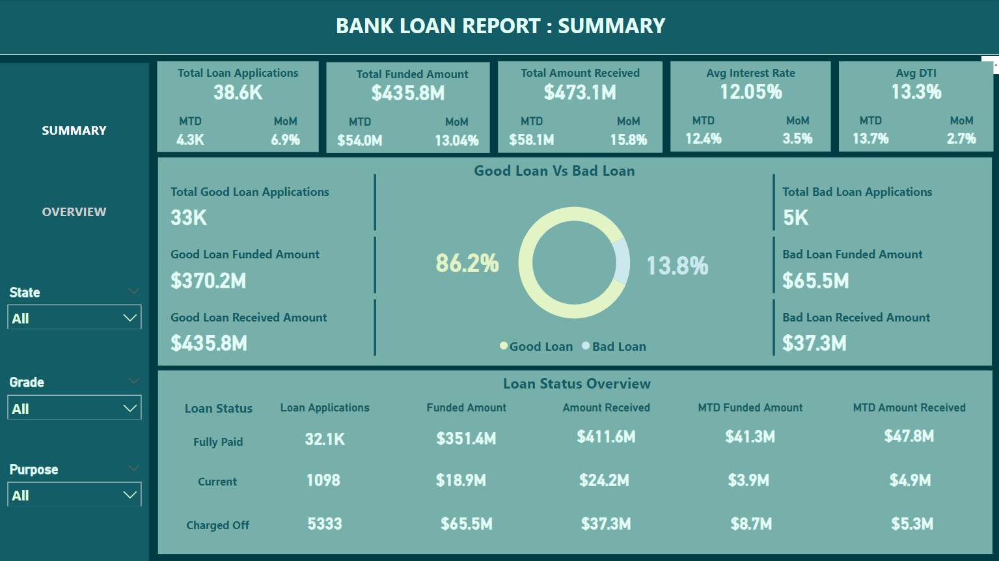
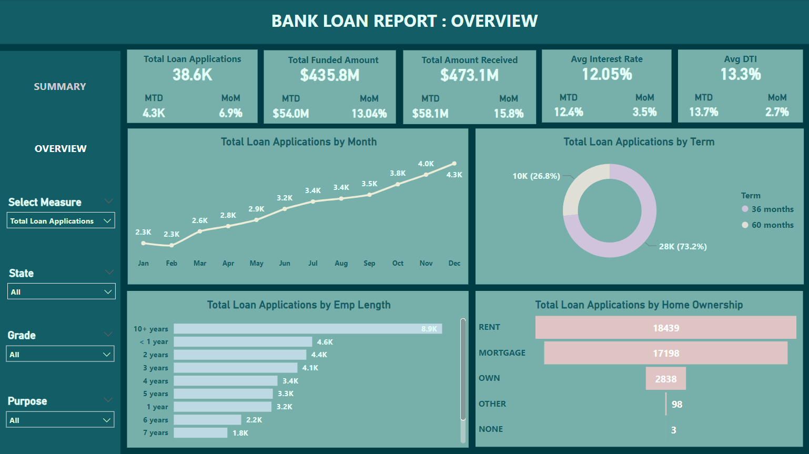

## Bank Loan Analysis
This repository contains the analysis of a bank loan dataset. The analysis was conducted using SQL for data cleaning and manipulation, followed by Power BI for visualization and insights.

## Dataset
The dataset includes the following columns:

id
address_state
application_type
emp_length
emp_title
grade
home_ownership
issue_date
last_credit_pull_date
last_payment_date
loan_status
next_payment_date
member_id
purpose
sub_grade
term
verification_status
annual_income
dti
installment
int_rate
loan_amount
total_acc
total_payment

## SQL Analysis
1. Data Cleaning and Manipulation:

Used SQL to clean the data, handling missing values and duplicates.
Transformed and standardized date formats.
Conducted data manipulation to prepare for analysis.

2. Insights Gained:

Utilized SQL joins to combine data from multiple tables.
Applied aggregate functions to summarize data.
Implemented window functions to perform calculations across data subsets.
Used subqueries to refine data extraction and insights.

## Power BI Visualization
1. Data Loading:

Loaded the cleaned bank loan data into Power BI.
Created a custom date table to facilitate time-based analysis.

2. DAX Functions:

Employed various DAX functions to calculate Key Performance Indicators (KPIs).
Calculated metrics such as total loan amounts, average interest rates, and default rates.
Visualizations:

3. Designed interactive dashboards to visualize insights.
Created measures and slicers to enable dynamic data exploration.

## Dataset Source 

YouTube: Data Tutorials: https://youtu.be/3I8wd1AShXs?si=NVtbU09pg0LfqKkg

## Dashboard Demo

